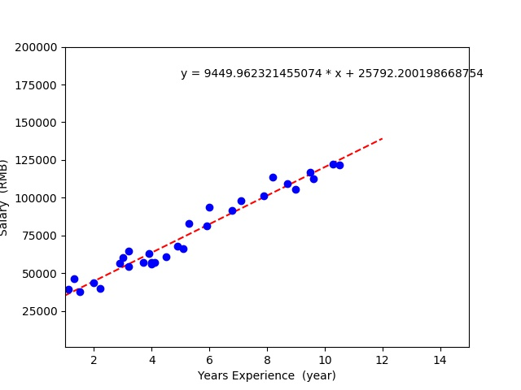

# linear regression

The sample data

| YearsExperience | Salary    |
| --------------- | --------- |
| 1.1             | 39343.00  |
| 1.3             | 46205.00  |
| 1.5             | 37731.00  |
| 2.0             | 43525.00  |
| 2.2             | 39891.00  |
| 2.9             | 56642.00  |
| 3.0             | 60150.00  |
| 3.2             | 54445.00  |
| 3.2             | 64445.00  |
| 3.7             | 57189.00  |
| 3.9             | 63218.00  |
| 4.0             | 55794.00  |
| 4.0             | 56957.00  |
| 4.1             | 57081.00  |
| 4.5             | 61111.00  |
| 4.9             | 67938.00  |
| 5.1             | 66029.00  |
| 5.3             | 83088.00  |
| 5.9             | 81363.00  |
| 6.0             | 93940.00  |
| 6.8             | 91738.00  |
| 7.1             | 98273.00  |
| 7.9             | 101302.00 |
| 8.2             | 113812.00 |
| 8.7             | 109431.00 |
| 9.0             | 105582.00 |
| 9.5             | 116969.00 |
| 9.6             | 112635.00 |
| 10.3            | 122391.00 |
| 10.5            | 121872.00 |

Use the linear regression to get the relation between the experience and the salary.
Least square method is the base of this solution.

